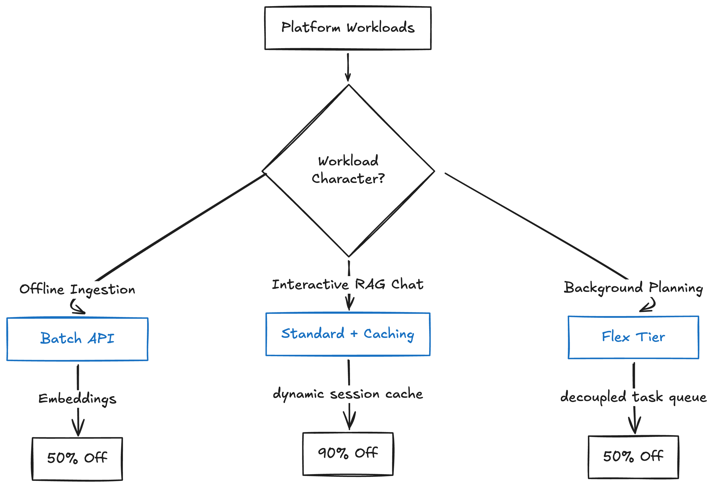

# 🗂️ Gemini API Optimization Demo



A Python-only command-line repository demonstrating high-performance **Gemini API Cost-Optimization Pathways** (Context Caching, Batch API, and the Flex Inference Tier) equipped with a beautiful `rich`-styled terminal interface and real-time financial cost-accounting engines.

---

## 📁 Repository Architecture

```
/optimization-demo
├── 1_batch_ingest.py           # Pathway 1: Ingestion Layer (Batch API + gemini-embedding-2)
├── 2_tutor_cache.py            # Pathway 2: Interactive Tutoring (Context Caching + gemini-3.5-flash)
├── 3_planner_flex.py           # Pathway 3: Study Planner (Flex Inference Tier + gemini-3.5-flash)
├── utilities.py                # Shared security checking, Rich Console styling, and Pricing engines
├── assignments_batch.jsonl     # Static manifest source containing 5 student essays
└── book.txt                    # M. Quinby - 'Mysteries of Bee-keeping Explained' (1853)
```

---

## 🧪 The Three Optimization Pathways

### 1. Ingestion Layer — [1_batch_ingest.py](1_batch_ingest.py)
* **Optimization Lever**: **Batch API** (flat **50% discount** on `gemini-embedding-2`).
* **How It Works**: Uploads the static `assignments_batch.jsonl` to the File API, runs a batch job, downloads the results, and exports the vectors to `assignments_embeddings.json`.
* **Telemetry**: Compares standard vs Batch rates, scaled per **1M requests**.

### 2. Interactive Tutoring — [2_tutor_cache.py](2_tutor_cache.py)
* **Optimization Lever**: **Explicit Context Caching** (up to **90% cheaper** input reads).
* **How It Works**: Caches the entire `book.txt` (~151,506 tokens) on the Gemini API, and runs a multi-turn Q&A chat session.
* **Telemetry**: Calculates standard vs cached rates, showing exact hit rate (**`99.98%`**) and cost savings (**up to `87% Off`**).

### 3. Custom Study Planner — [3_planner_flex.py](3_planner_flex.py)
* **Optimization Lever**: **Flex Inference Tier** (flat **50% discount** on sheddable off-peak capacity).
* **How It Works**: Routes planning queries to the `flex` tier inside a non-blocking background thread with exponential backoff preemption handling.
* **Telemetry**: Compares standard vs Flex rates, scaled per **1,000 requests**.

---

## 🛠️ Shared Telemetry Engine — [utilities.py](utilities.py)

All non-visual logic is consolidated in `utilities.py` to keep the core scripts under 120 lines of code:
* **`check_api_key()`**: Verifies the environment configuration.
* **`calculate_embedding_pricing()`**: Models `gemini-embedding-2` input costs.
* **`calculate_caching_pricing()`**: Pro-rates cache storage and hit-rate savings.
* **`calculate_flex_pricing()`**: Models standard vs Flex pricing models.

## 🚀 Setup & Execution Guide

1. **Create Virtual Environment & Install Dependencies**:
   Create a Python virtual environment, activate it, and install/upgrade the required libraries:
   ```bash
   python3 -m venv venv
   source venv/bin/activate
   pip install -U google-genai rich
   ```

2. **Configure API Key**:
   Export your Gemini API Key (get a free one at [ai.studio](ai.studio)) as an environment variable:
   ```bash
   export GEMINI_API_KEY="your-actual-gemini-api-key"
   ```

2. **Run Ingestion Layer (Pathway 1)**:
   ```bash
   python3 1_batch_ingest.py
   ```

3. **Run Context Caching Chatbot (Pathway 2)**:
   ```bash
   python3 2_tutor_cache.py
   ```

4. **Run Flex Planner Agent (Pathway 3)**:
   ```bash
   python3 3_planner_flex.py
   ```

---

## 🔗 Official Documentation & References

To learn more about the technical specifications, best practices, and API parameters for these optimization techniques, explore the official Google Gemini documentation:
* **Overview**: [Gemini API Optimization Guide](https://ai.google.dev/gemini-api/docs/optimization)
* **Pathway 1**: [Gemini Batch API Reference](https://ai.google.dev/gemini-api/docs/batch-api?batch=file)
* **Pathway 2**: [Gemini Context Caching Guide](https://ai.google.dev/gemini-api/docs/caching)
* **Pathway 3**: [Gemini Flex Inference Documentation](https://ai.google.dev/gemini-api/docs/flex-inference)
